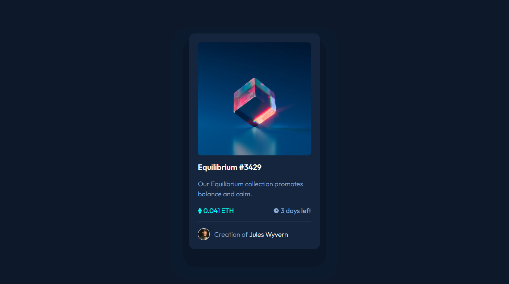

# Frontend Mentor - NFT preview card component solution

This is a solution to the [NFT preview card component challenge on Frontend Mentor](https://www.frontendmentor.io/challenges/nft-preview-card-component-SbdUL_w0U). Frontend Mentor challenges help you improve your coding skills by building realistic projects. 

## Table of contents

- [Overview](#overview)
  - [The challenge](#the-challenge)
  - [Screenshot](#screenshot)
  - [Links](#links)
- [My process](#my-process)
  - [Built with](#built-with)
  - [What I learnt](#what-i-learnt)
- [Author](#author)

## Overview

### The challenge

Users should be able to:

- View the optimal layout depending on their device's screen size
- See hover and focus states for interactive elements

### Screenshot

### Links

- Solution URL: [NFT preview card -Solution](https://github.com/Mohan823/nft-preview-card.git)
- Live Site URL: [NFT preview card -Live](https://mohan823.github.io/nft-preview-card/)

## My process

- Creating variables for future ready responsive website.
- Targetting which one is most important (mobile/desktop)
- Then, I made css for that then convert it for another devices via media queries.

### Built with

- Semantic HTML5 markup
- CSS custom properties
- Flexbox
- CSS Grid

### What I learnt

- Actually the mobile layout not good when resizing. because its not responsive. so i decided to shrink both images and padding of it's container. So i used here min() function and clamp() function to achieve this.

## Author

- Frontend Mentor - [Mohan Krishna](https://www.frontendmentor.io/profile/Mohan823)
